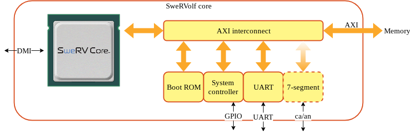

# Setting up docker image

For your convenience there is a docker image that contains the tools. You can either build it yourself or download it [here (1.3GB)](https://syncandshare.lrz.de/dl/fiVDUFw67zvz7trnsVLD9LiR/ca_workshop_munich.tar.gz).

To build yourself, run

```
docker build -t ca_workshop_munich
```

Or load it from the downloaded tar.gz:

```
docker load < ca_workshop_munich.tar.gz
```

You can then run the commands from below inside the docker machine after entering it with

```
docker run -v $PWD/axi_sevenseg:/workspace/axi_sevenseg -ti ca_workshop_munich
```

# Introduction

The SweRVolf SoC was built to be modified and extended to fit different applications and hardware.

In this tutorial we will add a new peripheral controller for the 7-segment display found on the Nexys A7 board so that it's possible to control from software.

As the peripheral controller has been written and verified in the first part of the tutorial, this part will focus on the steps needed to integrate it into the SoC, write software to use it and run a full-system simulation. If time permits, the same code will also be run on a real Nexys A7 board.

# Peripheral controller setup


The 7-segment controller has been prepared in the `axi_sevenseg` directory. The directory contains the following files

* wb_sevenseg.v : Implementation of the 7-segment controller logic with a Wishbone interface
* axi2wb.v : AXI to Wishbone converter
* axi_sevenseg.sv : Wrapper around wb_sevenseg and axi2wb to create a 7-segment controller with AXI interface
* sseg.c/sseg.h : Verilator BFM for 7-segment display.
* sseg_tb.cpp : Rudimentary Verilator testbench
* axi_sevenseg.core : FuseSoC core description file

The first three files is the RTL implementation, the next three are for verification and the final file is read by FuseSoC to find out the properties of the core that it needs to know. It contains information such as the core's name (VLNV identifier) which files it contains, any specific parameters that needs to be set and so on. Every core file that FuseSoC finds will be added to its internal database.

## Register a core library

**Task 1:** See which cores FuseSoC has detected by running `fusesoc core list`.

Examining the list you will notice that there is no 7-segment driver there. This is because FuseSoC doesn't automatically know where to find cores. The file *fusesoc.conf* in the workspace directory (togeteher with a corresponding file in ~/.config) tells FuseSoC where to find cores. Therefore, we need to tell FuseSoC where to look for it. We do this by registering the directory containing the core as a new library.

**Task 2:** Add the directory containing the 7-segment controller as a FuseSoC library with `fusesoc library add sseg axi_sevenseg`

This tells FuseSoC to add a library called sseg that resides in the directory `axi_sevenseg`. Run `fusesoc core list` again to see that it now lists a core called `chipsalliance.org::axi_sevenseg:0`.

**Task 3:** Find more info about the core by running `fusesoc core show chipsalliance.org::axi_sevenseg`

## Execute a target

This will tell us where the core is located and what targets it has. A target is an action we want to perform on the core. This can be things like simulating the core or synthesising it. Each of these targets will likely require a different subset of files, parameters and tool settings. One of these targets defined for the 7-segment driver is the `lint` target. It is provided to check for code issues with the core.

**Task 4:** Run the lint target with `fusesoc run --target=lint chipsalliance.org::axi_sevenseg` and fix potential code issues until no errors are reported.

## Create a new target

Normally, a core also contains a testbench. The 7-segment driver actually has a rudimentary verilator testbench but there is no target defined to run it.

**Task 5:** Open up the core description file at `axi_sevenseg/axi_sevenseg.core` to see what the core description file looks like. Add a new target for the testbench with the following properties.

1. The name of the new target should be `sim`. (Note that FuseSoC allow the target to be called anything, but we will give it a known name for the sake of simplicity writing these instructions)
2. It should use verilator as the default tool.
3. It should use the rtl fileset, the bfm and the newly created fileset with the C++ testbench found in `sseg_tb.cpp`
4. It should use wb_sevenseg as the toplevel module
5. The verilator option `--trace` should be set
6. It should support the `vcd` parameter that is defined in the core description file.

Look at the existing targets for inspiration and consult the [CAPI2 reference](https://fusesoc.readthedocs.io/en/master/capi2.html) for available options and syntax.

**Task 6:**: Once the new target is in place, run `fusesoc core show chipsalliance.org::axi_sevenseg` to see that the new target shows up and then run `fusesoc run --target=sim chipsalliance.org::axi_sevenseg` to build and run the testbench. We can also produce a VCD trace by running `fusesoc run --target=sim chipsalliance.org::axi_sevenseg --vcd`. The trace will show up in `build/chipsalliance.org__axi_sevenseg_0/sim-verilator/trace.vcd`

# SoC integration

Now we have checked and verified the core itself and it's time to integrate it into the SweRVolf SoC as a memory-mapped peripheral controller on the AXI bus. This also means that we will no longer be able to directly access the internal interface to test it, but instead write software running on the SoC to drive the controller.



The SweRVolf SoC has been prepared for the tutorial and resides in `fusesoc_libraries/Cores-SweRVolf`. The task is to modify the SweRVolf SoC to include the 7-segment driver, create a small test program and run it in a full-system simulation.

But before we get started with the integration we will get briefly acquintanted with the SweRVolf SoC.

SweRVolf is an extendible and portable SoC built around the SweRV EH1 core. In its form used in this tutorial it also has a boot ROM, RAM, GPIO, UART and debug interface. There are targets for use in simulation, primarily ModelSim/QuestaSim and Verilator as well as a target for building an FPGA image for the Nexys A7 board with Vivado. More detailed information about SweRVolf can be found [here](https://github.com/chipsalliance/Cores-SweRVolf)

On hardware, the software to run is usually written to RAM through the debug interface, fetched from SPI Flash or if it's small enough, written directly into the boot ROM. In simulation, the easiest way to run a program is to write it directly into the RAM before the simulation starts.

**Task 7:** Run a simulation of the SoC using the default program with `fusesoc run --target=sim swervolf`

This should build the simulation model, run it, print a string and exit

As a next step, we will create our own program to run on the SoC. Put the following code in `fusesoc_libraries/Cores-SweRVolf/sw/chips.S`

```
#define CONSOLE_ADDR 0x80001008
#define HALT_ADDR    0x80001009

	/*
	a0 = Console address
	a1 = String address
	t0 = Character to write
	*/

.globl _start
_start:
	/* Load console address to a0 */
	li	a0, CONSOLE_ADDR

	/* Load string address to a0 */
	la	a1, str

	/* Load first byte */
	lb	t0,0(a1)
next:
	/* Write to console and load next char until we get \0 */
	sb	t0, 0(a0)
	addi	a1, a1, 1
	lb	t0, 0(a1)
	bne	t0, zero, next

	/* Halt simulation */
	li	a1, HALT_ADDR
	sw	zero, 0(a1)
str:
	.section .data
	.string "     __\n   []  []-o CHIPS\n o-[]  []\n   []  []-o ALLIANCE\n o-[]__[]\n\n"
```

As for the next step, we need to compile the assembler code into a program and convert it into verilog hex format that the simulator can read. SweRVolf has some useful Makefile targets for this.

**Task 8:** Compile a custom program by entering `fusesoc_libraries/Cores-SweRVolf/sw` and run `make chips.vh`.

This will compile the assembler code, do the necessary conversion steps and provide us with a *chips.vh*  in a format suitable for loading into the simulated memory.

For the last step we need to tell FuseSoC to use this file to preload the simulated RAM.

**Task 9:** Go back to the workspace directory and run `fusesoc run --run --target=sim swervolf --ram_init_file=fusesoc_libraries/Cores-SweRVolf/sw/chips.vh` to run the newly compiled program.

Notice the added `--run` flag used when calling FuseSoC. This tells FuseSoC to skip the *setup* and *build* steps and just run the model that has been already compiled. Since we have only changed the software and nothing on the RTL side, we don't need to spend time rebuilding the simulation model.

That's all we need to know for now. Let's start the work to integrate the 7-segment controller into the SoC

## Dependencies

The first step is to add our 7-segment driver as a dependency of SweRVolf.

**Task 10:** Open `fusesoc_libraries/Cores-SweRVolf/swervolf.core` and add `chipsalliance.org::axi_sevenseg` as a dependency of the `core` fileset.

By adding the 7-segment driver as a dependency, FuseSoC will include its files when building the SoC. It would also pick up any extra tool options, parameters, generators and other things exposed by the 7-segment driver's *default* target.

## Integrating the RTL

Adding the dependency will however not automatically make any RTL changes in the SoC toplevel. We will still need to instantiate the core, hook it up to the AXI interconnect and expose the external pins. FuseSoC will still help us a bit with this work though. As can be seen in the block diagram above, we need to add it to the SweRVolf core module.

**Task 11:** Instantiate the AXI 7-segment wrapper in the SweRVolf core by adding the following to `fusesoc_libraries/Cores-SweRVolf/rtl/swervolf_core.v`

```
   axi_sevenseg_wrapper
     #(.ID_WIDTH  (`RV_LSU_BUS_TAG+2))
   sevenseg
     (.clk        (clk),
      .rst_n      (rst_n),
      .o_ca       (o_ca),
      .o_an       (o_an),
      .i_awid     (sevenseg_awid),
      .i_awaddr   (sevenseg_awaddr[11:0]),
      .i_awlen    (sevenseg_awlen),
      .i_awsize   (sevenseg_awsize),
      .i_awburst  (sevenseg_awburst),
      .i_awvalid  (sevenseg_awvalid),
      .o_awready  (sevenseg_awready),
      .i_arid     (sevenseg_arid),
      .i_araddr   (sevenseg_araddr[11:0]),
      .i_arlen    (sevenseg_arlen),
      .i_arsize   (sevenseg_arsize),
      .i_arburst  (sevenseg_arburst),
      .i_arvalid  (sevenseg_arvalid),
      .o_arready  (sevenseg_arready),
      .i_wdata    (sevenseg_wdata),
      .i_wstrb    (sevenseg_wstrb),
      .i_wlast    (sevenseg_wlast),
      .i_wvalid   (sevenseg_wvalid),
      .o_wready   (sevenseg_wready),
      .o_bid      (sevenseg_bid),
      .o_bresp    (sevenseg_bresp),
      .o_bvalid   (sevenseg_bvalid),
      .i_bready   (sevenseg_bready),
      .o_rid      (sevenseg_rid),
      .o_rdata    (sevenseg_rdata),
      .o_rresp    (sevenseg_rresp),
      .o_rlast    (sevenseg_rlast),
      .o_rvalid   (sevenseg_rvalid),
      .i_rready   (sevenseg_rready));
```

Also add the following new outputs of the module

```
    output wire [6:0]  o_ca,
    output wire [7:0]  o_an,
```

## Regenerating AXI interconnect

The next step is to hook it up to the AXI interconnect in SweRVolf core. You may notice however that there is no interconnect module in the file. The only trace is an `` `include "axi_intercon.vh"`` but this file is not to be found either.

This is because a FuseSoC feature called a *generator* is used to create, or generate, a parametrized interconnect dynamically during the build. Open `swervolf.core` and look at e.g. the sim target. In this section there is a line that says `generate : [intercon, swerv_default_config, version]`. This tells FuseSoC to run the three mentioned parametrized generators when the sim target is being used. For a definitition of the *intercon* parametrized generator, look further down in the *generate*  section of the core description file. Here you will find a subsection called *intercon*. This subsection has two entries. *generator*, tells FuseSoC which generator to use and *parameters* indicates which parameters to send to the generator. In this case we use the *axi_intercon_gen*  generator with a list of master and slave ports with associated base addresses and other properties.

The generator *axi_intercon_gen* itself is defined in another core description file, which allows it to be included into any project that needs to generate an AXI interconnect by just adding it as a dependency and define a section in the top-level core file. To find out more about axi_intercon_gen, run `fusesoc gen show axi_intercon_gen`. This will print out some usage information and in which core the generator is defined. `fusesoc gen list` will list all generators that FuseSoC has found

**Task 12:** Add a new slave port called sevenseg with base address `0x90000000` and size `0x1000`

The inclusion of the new 7-segment controller is now finished on the RTL level. What we need to do now is to write software to control it and add the bits to the testbench to check the result.

## Modifying the testbench

Add the following to  `fusesoc_libraries/Cores-SweRVolf/tb/swervolf_core_tb.v` to pass on the o_ca and o_an pins from swervolf_core outwards to the verilator testbench.

Top-level ports:

    output wire [6:0] o_ca,
    output wire [7:0] o_an,

swervolf_core instantiation:

    .o_ca (o_ca),
    .o_an (o_an),

In the verilator testbench (`fusesoc_libraries/Cores-SweRVolf/tb/swervolf_core_tb.v`) we need to do three things.

1. Include the 7-segment BFM header file

        #include "sseg.h"

2. Declare a sseg_context variable in the main function

        sseg_context_t sseg_context;

3. Look for changes on the 7-segment pins in the simulation loop and print them

        if (do_sseg(&sseg_context, top->o_an, top->o_ca))
          printf("7-segment display : %08x\n", sseg_to_int(sseg_context.data));

With the RTL and testbench complete, we now turn to the software. At this point
we can also do a test build of the SoC without running the simulation by using `fusesoc run --target=sim --setup --build swervolf`. This will hopefully warn us if there are any code issues, in which case we can investigate.

## Create and run test software

For the software, we will simply modify the chips example used before. Instead of halting the simulation after outputting the CHIPS Alliance logo, we will now write a word to the address on the memory map where we defined the 7-segment driver to be and loop, so that the testbench can run until the correct word appears on the simulated 7-segment pins.

**Task 14:** Modify the chips.S example to write to the 7-segment display and wait instead of exiting afterwards.

```
	li	t0, 0x90000000
	li	t1, 0xbadc0fee
	sw	t1, 0(t0)

loop:	j	loop

	/* Halt simulation */
	li	a1, HALT_ADDR
	sw	zero, 0(a1)
```

Recompile *chips.vh* and run the simulation

## Create an FPGA image

If Vivado is installed, it is possible to compile an FPGA image for the Nexys A7 board by running `fusesoc run --target=nexys_a7 swervolf`.
